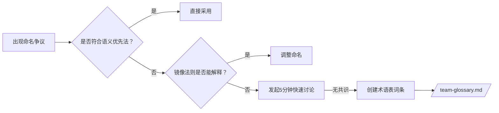

# 文件命名黄金决策法

> 适用于团队宣导的「文件命名黄金决策法」，包含原则、场景范例和记忆口诀

## 3个核心原则

### 原则一：语义优先法

**"文件命名必须反映其内容本质，而非机械匹配单复数"**

| 内容本质     | 正确命名          | 错误命名           |
| ------------ | ----------------- | ------------------ |
| 单一功能实体 | `user.service.ts` | `users.service.ts` |
| 多个独立实体 | `users.ts`        | `user.ts`          |
| 抽象概念     | `permission.ts`   | `permissions.ts`   |
| 工具函数集合 | `dom.utils.ts`    | `dom-util.ts`      |

**决策口诀：**  
🔔 **"独狼单数走，群狼复数行，概念永单数"**

### 原则二：目录-文件镜像法则

**"目录是容器，文件是内容；目录表范畴，文件表实体"**

| 目录性质 | 目录示例      | 文件正确示例            | 说明                     |
| -------- | ------------- | ----------------------- | ------------------------ |
| 集合容器 | `/components` | `Button.vue` (单数)     | 目录用复数，内含单一组件 |
| 工具集合 | `/utils`      | `array.utils.ts` (复数) | 目录复数，文件工具集合   |
| 概念空间 | `/auth`       | `strategy.ts` (单数)    | 目录单数，表抽象领域     |
| 配置空间 | `/config`     | `env.config.ts` (单数)  | 目录单数，文件配置实例   |

**决策口诀：**  
🔔 **"容器复数装个体，概念单数含万物"**

### 原则三：Hook特例法则

1. **单个Hook文件：** `useWindowSize.ts`
2. **关联Hook集合：** `table-hooks.ts` (含 `usePagination`, `useSelection`)
3. **永远禁止：** `usePaginationHooks.ts` (语义重复)

**决策口诀：**  
🔔 **"Hook 用 use 起，一个单数多个集"**

## 您案例的完美解决方案

```
constants/
- ├── rule.ts     ❌ 歧义命名
+ ├── rules.ts    ✅ 含多个规则
+ └── rule-set.ts ✅ 强关联规则集合
```

**解析：**

1. 若文件导出多个独立规则 → 用复数 `rules.ts`
2. 若规则是强关联整体 → 用组合名 `rule-set.ts`
3. 永不用单数 `rule.ts` (会被理解为规则基类)

## 团队争议解决机制

当命名出现分歧时，按序自检：



## 术语表模板

### 团队约定术语 (强制执行)

| 概念         | 命名规范         | 示例                |
| ------------ | ---------------- | ------------------- |
| 验证规则集合 | `*-rules.ts`     | `form-rules.ts`     |
| 配置项集合   | `*.config.ts`    | `theme.config.ts`   |
| API 端点聚合 | `*-endpoints.ts` | `user-endpoints.ts` |

## 宣导关键点

### 1. 工具只是辅助

- `ls-lint` 仅校验基础格式（kebab-case/camelCase），语义靠人脑
- 不要过度依赖工具，保持灵活性

### 2. 宽容期政策

- 新规范实施前2周，PR审查时温柔提醒
- 给团队成员适应时间

### 3. 豁免权机制

- 特殊场景下可在文件名后加 `!` 临时绕过
- 例如：`experimental-rules!.ts`

---

> 💡 **记住：实际场景复杂多变，过度依赖工具和繁复的规则反而会增加维护成本。保持简单，保持语义清晰！**
