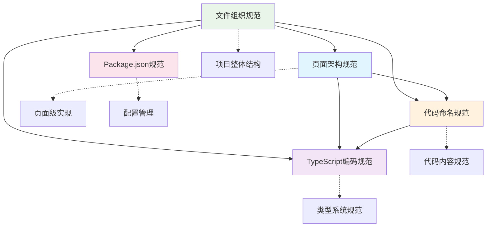

# @lyndon/code-spec

[](https://nodejs.org/)
[](https://pnpm.io/)
[](https://www.typescriptlang.org/)
[](LICENSE)

企业级前端编码规范库，提供**文件组织**、**页面架构**、**代码命名**、**TypeScript 类型系统**、**配置管理**等完整规范体系。配套丰富的实践示例和自动化工具链，专为 React/TypeScript 项目的标准化开发而设计。

## ✨ 核心特性

### 📚 编码规范体系

- **📁 文件组织规范** - 语义优先、领域分组、复数/单数命名决策
- **🏗️ 页面架构规范** - 容器-组件模式、目录职责、React 最佳实践
- **🏷️ 代码命名规范** - 变量、函数、类、组件的统一命名约定
- **🔧 TypeScript 规范** - Enum、Interface、联合类型的专业指导
- **📦 配置管理规范** - Package.json 字段排序、项目类型最佳实践

### 🛠️ 开发工具链

- **TypeScript 5.8+** - 类型安全，现代开发体验
- **ESLint 9.x** - 代码质量检查，Flat Config 配置
- **Prettier 3.x** - 代码格式化，统一代码风格
- **Husky 9.x** - Git 钩子管理，自动化工作流
- **lint-staged** - 仅对暂存文件执行检查，提升效率
- **Commitlint** - 提交信息规范化，遵循 Angular 规范
- **ls-lint** - 文件/文件夹命名规范自动校验

### 🎯 项目价值

- **完整规范体系** - 从文件组织到代码编写的全流程标准
- **丰富实践示例** - 配套完整的示例代码，理论与实践结合
- **自动化工作流** - 提交前自动检查，保障代码质量
- **团队协作友好** - 统一的编码标准，降低沟通成本
- **企业级应用** - 适用于大型 React/TypeScript 项目的规范化管理

## 📁 项目结构

```
code-spec/
├── .cursor/rules/          # 编码规范文档
│   ├── file-organization.mdc    # 文件组织规范
│   ├── page-architecture.mdc    # 页面架构规范
│   ├── code-naming.mdc          # 代码命名规范
│   ├── typescript.mdc           # TypeScript 编码规范
│   └── package-json.mdc         # Package.json 字段规范
├── src/                    # 规范实践示例
│   ├── components/         # 全局共享组件示例
│   │   └── ui/            # 基础 UI 组件
│   ├── constants/         # 常量管理示例
│   ├── types/             # TypeScript 类型定义示例
│   ├── utils/             # 工具函数组织示例
│   │   ├── dates.ts       # 日期专用工具集合
│   │   ├── formatters.ts  # 通用格式化工具集合
│   │   └── mocks.ts       # Mock 数据工具
│   └── pages/             # 页面架构示例
│       ├── home/          # 简单页面示例
│       └── hotel/facility/ # 复杂业务页面示例
├── .husky/                # Git 钩子配置
├── .vscode/              # VS Code 配置
├── eslint.config.js      # ESLint 配置（Flat Config）
├── prettier.config.js    # Prettier 配置
├── .ls-lint.yml         # 文件命名规范配置
├── commitlint.config.js  # 提交信息规范配置
├── tsconfig.json        # TypeScript 配置
└── package.json         # 项目配置（遵循字段排序规范）
```

## 🚀 快速开始

### 环境要求

- **Node.js**: >= 20.x
- **pnpm**: >= 10.x

### 1. 克隆项目

```bash
git clone https://github.com/lyndon/code-spec.git
cd code-spec
```

### 2. 安装依赖

```bash
pnpm install
```

### 3. 开发命令

```bash
# 构建项目
pnpm build

# 开发模式（监听文件变化）
pnpm dev

# 清理构建文件
pnpm clean

# 重新构建
pnpm rebuild

# 代码检查
pnpm lint

# 代码检查（仅检查，不修复）
pnpm lint:check

# 代码格式化
pnpm format

# 代码格式化检查
pnpm format:check

# 类型检查
pnpm type-check

# 文件命名规范检查
pnpm ls-lint
```

## 📚 编码规范体系

本项目提供了完整的编码规范体系，涵盖从文件组织到代码编写的各个方面：

### 🎯 规范导航

| 规范文件                                                | 适用范围     | 核心内容                     | 快速跳转                                                                                                                                                                                                                |
| ------------------------------------------------------- | ------------ | ---------------------------- | ----------------------------------------------------------------------------------------------------------------------------------------------------------------------------------------------------------------------- |
| **[文件组织规范](.cursor/rules/file-organization.mdc)** | 项目文件结构 | 文件命名、目录结构、导出方式 | [语义优先法则](.cursor/rules/file-organization.mdc#语义优先法则) • [领域分组法则](.cursor/rules/file-organization.mdc#领域分组优于命名前缀法则) • [复数/单数命名](.cursor/rules/file-organization.mdc#复数单数命名规范) |
| **[页面架构规范](.cursor/rules/page-architecture.mdc)** | 页面级组织   | 容器-组件模式、目录职责      | [容器-组件模式](.cursor/rules/page-architecture.mdc#容器-组件模式详解) • [目录结构](.cursor/rules/page-architecture.mdc#标准页面目录结构)                                                                               |
| **[代码命名规范](.cursor/rules/code-naming.mdc)**       | 标识符命名   | 变量、函数、类、React组件    | [通用规则](.cursor/rules/code-naming.mdc#通用命名规则) • [布尔值决策](.cursor/rules/code-naming.mdc#布尔值命名决策流程)                                                                                                 |
| **[TypeScript编码规范](.cursor/rules/typescript.mdc)**  | 类型系统     | Enum、Interface、联合类型    | [Enum命名](.cursor/rules/typescript.mdc#enum-命名规范) • [联合类型](.cursor/rules/typescript.mdc#联合类型命名规范)                                                                                                      |
| **[Package.json规范](.cursor/rules/package-json.mdc)**  | 项目配置     | 字段排序、项目类型示例       | [字段排序](.cursor/rules/package-json.mdc#标准字段排序-基于业界最佳实践) • [最佳实践](.cursor/rules/package-json.mdc#最佳实践示例)                                                                                      |

### 🔗 规范关系



### 📖 使用指南

#### 🚀 新项目开始

1. 参考 [文件组织规范] 建立项目结构
2. 按照 [Package.json规范] 配置项目依赖
3. 遵循 [代码命名规范] 编写代码

#### 🏗️ 页面开发

1. 按照 [页面架构规范] 组织页面文件
2. 使用 [TypeScript编码规范] 定义类型
3. 遵循 [代码命名规范] 命名组件和状态

#### 🔧 团队协作

所有规范互相配合，形成完整的编码标准体系，确保团队代码风格统一、可维护性强。

## 🛠️ 开发工具链

### 代码风格

- **ESLint**: 使用 Flat Config 配置，支持 TypeScript
- **Prettier**: 统一代码格式化，与 ESLint 完美集成
- **导入排序**: 自动按字母顺序排序，不同组间空行分隔

### 文件命名规范

使用 `ls-lint` 自动校验文件/文件夹命名：

- **普通文件/文件夹**: 必须使用 `kebab-case`（短横线命名）
- **Hook 文件**: 以 `use` 开头的文件允许使用 `camelCase`（如 `useModel.ts`）

### Git 提交流程

#### 自动化检查

1. **pre-commit 钩子**:
   - 执行 `lint-staged`，仅检查暂存文件
   - 自动修复 ESLint 问题
   - 自动格式化代码
   - 检查文件命名规范

2. **commit-msg 钩子**:
   - 使用 Commitlint 校验提交信息
   - 遵循 Angular 提交规范

#### lint-staged 配置

```json
{
  "*": ["ls-lint"],
  "*.{js,jsx,ts,tsx}": ["eslint --fix", "prettier --write"],
  "*.{json,md,yml,yaml}": ["prettier --write"]
}
```

#### 提交信息规范

格式：`<type>(<scope>): <subject>`

**类型 (type)**:

- `feat`: 新功能
- `fix`: 修复 bug
- `docs`: 文档更新
- `style`: 代码格式调整
- `refactor`: 重构
- `perf`: 性能优化
- `test`: 测试相关
- `chore`: 构建/工具相关
- `revert`: 回滚
- `build`: 构建系统
- `ci`: 持续集成

**示例**:

```bash
feat(user): 添加用户登录功能
fix(auth): 修复登录验证逻辑
docs(readme): 更新项目说明文档
style(eslint): 调整代码格式化规则
```

## 📦 主要依赖

### 生产依赖

- [dayjs](https://day.js.org/) - 轻量级日期处理库
- [lodash-es](https://lodash.com/) - 实用工具函数库
- [zod](https://zod.dev/) - TypeScript 优先的模式验证

### 开发依赖

- [TypeScript](https://www.typescriptlang.org/) - JavaScript 的超集
- [ESLint](https://eslint.org/) - 代码质量检查工具
- [Prettier](https://prettier.io/) - 代码格式化工具
- [Husky](https://typicode.github.io/husky/) - Git 钩子管理
- [lint-staged](https://github.com/okonet/lint-staged) - 暂存文件检查
- [Commitlint](https://commitlint.js.org/) - 提交信息规范检查
- [ls-lint](https://ls-lint.org/) - 文件命名规范检查

## 🔧 配置说明

### ESLint 配置

- 使用 Flat Config 格式
- 集成 TypeScript 支持
- 与 Prettier 完美配合
- 自动导入排序

### Prettier 配置

- 单行最大长度: 120 字符
- 缩进: 2 个空格
- 使用双引号
- 尾随逗号: 全部

### TypeScript 配置

- 严格模式启用
- ESNext 目标
- 模块解析: bundler
- 输出目录: `./dist`

## 🤝 贡献指南

### 开发流程

1. **Fork 项目**并创建功能分支
2. **安装依赖**: `pnpm install`
3. **开发代码**，确保通过所有检查
4. **提交代码**，遵循提交规范
5. **创建 Pull Request**

### 代码检查

提交前会自动执行以下检查：

- ✅ ESLint 代码质量检查
- ✅ Prettier 代码格式化
- ✅ ls-lint 文件命名规范
- ✅ Commitlint 提交信息规范

### 手动检查

```bash
# 代码质量检查
pnpm lint

# 代码格式化
pnpm format

# 类型检查
pnpm type-check

# 文件命名检查
pnpm ls-lint
```

## 📄 开源协议

本项目基于 [MIT License](LICENSE) 开源，欢迎自由使用和贡献。

## 📞 联系方式

- **作者**: Lyndon
- **邮箱**: wuxianzhi052@gmail.com
- **GitHub**: [@lyndon](https://github.com/lyndon)
- **Issues**: [GitHub Issues](https://github.com/lyndon/code-spec/issues)

## 🙏 致谢

感谢所有为这个项目做出贡献的开发者们！

---

⭐ 如果这个项目对您有帮助，请给我们一个 Star！
